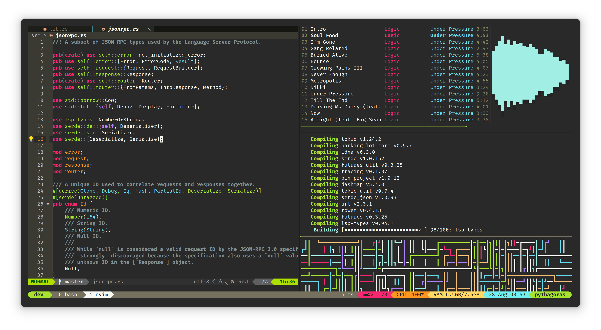

# Dotfiles

These are for my own personal use, frequent breakage may occur. Distributed
under the terms of the [MIT License](./COPYING).



## Included configs

* Bash
* Git
* mpd/ncmpcpp
* NeoVim
* tmux
* top

## Installation

```
$ git clone https://github.com/ebkalderon/dotfiles ~/.dotfiles
$ cd ~/.dotfiles
$ ./bootstrap.sh
```

